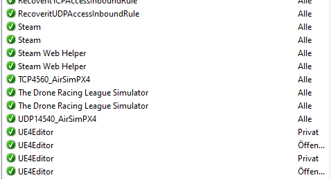
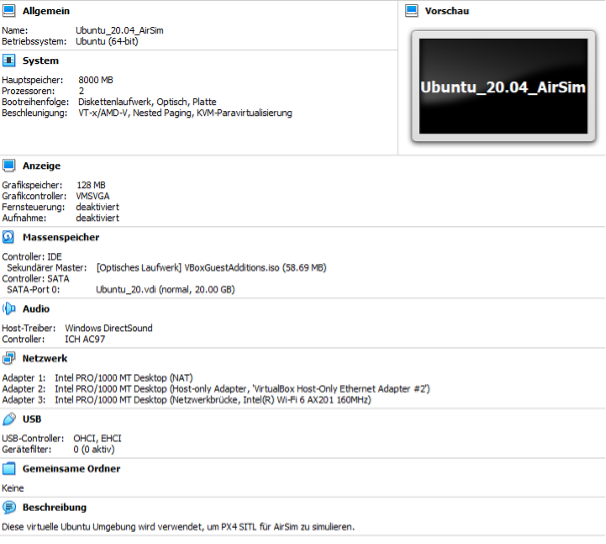
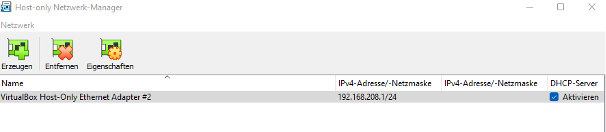
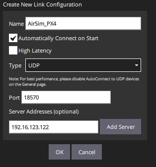

# SORASim Installation Guide

The following documentation contains information about the installation of all parts of the UAV Simulator. This includes AirSim, PX4, Gazebo, MAVSDK, and QGroundControl. The following information is to be understood as additional documentation to the already existing installation and operating instructions on the websites of the manufacturers and developers. The table of content below provides an overview of the contents of the documentation. 

# Table of Content

- [AirSim Installation](#airsim-installation-guide-windows)
  * [AirSim on Windows](#airsim-on-windows)
  * [AirSim on Linux](#airsim-on-linux)
- [AirSim-Python API Installation](#airsim-python-api-installation)
- [Installation of PX4 SITL (using WSL)](#installation-of-px4-sitl-using-wsl)
  * [Troubleshooting if AirSim and PX4 won't connect](#troubleshooting-if-airsim-and-px4-wont-connect)
  * [Further Information](#further-information)
    + [PX4 Log File Storage Folder](#px4-log-file-storage-folder)
    + [Helpful Linux Code](#helpful-linux-code)
- [VM (VirtualBox) Setup](#vm-virtualbox-setup)
    * [Settings PX4 and Gazebo in combination with AirSim](#settings-px4-and-gazebo-in-combination-with-airsim)
    * [Settings PX4 in combination with AirSim (without Gazebo)](#settings-px4-in-combination-with-airsim-without-gazebo)
    * [Network Settings](#network-settings)
- [Gazebo Installation](#gazebo-installation)
    * [Additional information](#some-useful-information)
- [MAVSDK-Python Installation](#mavsdk-python-installation)
- [QGroundControl Installation](#qgroundcontrol-installation)
- [Simulator Automation Requirements (SSH Setup)](#simulator-automation-requirements-ssh-setup)
- [PX4 & Gazebo Code Documentation](#px4--gazebo-code-documentation)
    * [Adding new aircraft/drone model](#adding-new-aircraftdrone-model)
    * [Adding new world file](#adding-new-world-file)


# AirSim Installation

The installation guide is intended to add information to AirSim's [official documenetation](https://microsoft.github.io/AirSim/build_windows/) and the [installation video](https://www.youtube.com/watch?v=1oY8Qu5maQQ&ab_channel=ChrisLovett) of Chris Lovett. This file contains certain details that were not included in either of the other two sources. 

## AirSim on Windows

1. Download Unreal Launcher and install Unreal Engine \>= 4.25
2. Install Microsoft Visual Studio 2019 and 2022 and the following packages:
    - Desktop Development with C++
    - Windows 10 SDK 10.0.18362
    - Newest .NET Framework SDK

> **NOTE:** Visual Studio 2019 is only required to install AirSim (v1.7.0). To set up the Unreal project the newer version of Visual Studio was needed as with the version of 2019 several issues where experienced. According to the [AirSim's repository](https://github.com/microsoft/AirSim) newer version should also support VS 2022


3. Create an Unreal project and download a suitable Unreal World (e.g. Landscape Mountains) from the Unreal Editor or from the **Assets** list of the corresponding release on the [AirSim repository](https://github.com/microsoft/AirSim/releases/tag/v1.8.1-windows).
4. To create the Unreal project correctly select: "New Project Categories>Games>Blank Projec>" then change the option Blueprint to C++ keep the rest of the settings as default and change the location and name of the project. 
5 .Merge the downloaded world environment with the created project: 
    - Copy the folder "Maps" and "Assets" from the "Content" folder of the downloaded Unreal World (e.g. Landscape Mountains) to the "Content" folder of the creatd project
    - Copy the folder "DerivedDataCache" from the downloaded Unreal World (e.g. Landscape Mountains) to the "Content" folder of the creatd project
    - Copy the content of the "DefaultEngine.ini" file from the "Config" folder of the downloaded Unreal World (e.g. Landscape Mountains) to same file of the new Unreal project. Only add new content but do not overwrite the existing content
6. Install AirSim by opening the Developer Command Prompt for Visual Studio 2022.
7. Change the directory to a folder that is not in the C: directory, otherwise the permissions to download the AirSim files are missing and Visual Studio must be executed as Admin
8. Execute the command `git clone https://github.com/Microsoft/AirSim.git`


> **NOTE:** If the command can not found Git, it must be installed first with the following link: [http://git-scm.com/download/win](http://git-scm.com/download/win)

9. After successfully downloading the AirSim files, change to the AirSim folder `cd AirSim`
10. Install them by type in `build.cmd`. It will create a folder which can then be added to the existing Unreal project
    - Copy the folder `AirSim\Unreal\Plugins` into the main directory of your Unreal project
11. Restart Visual Studio 2022 and open the file 'xxxx.uproject' which is in the folder of your Unreal project.
12. Copy the following [code](https://microsoft.github.io/AirSim/unreal_custenv/) to the end of the file you just opened

```
"AdditionalDependencies": [
    "AirSim"
]
"Plugins": [
    {
        "Name": "AirSim",
        "Enabled": true
    }
]
```

13. Open the created Unreal project with the Unreal Editor select `File>Refresh Visual Studio Projects` to apply the changes and open Visual Studio
14. Open the settings inside the Unreal Editor through `Window>World Settings` and change the Game Mode to **AirSimGameMode**.
15. Search in the search bar of the *World Outliner* settings for *Player Start Position* and delete all available start positions except for one
16. Move the launch position close to the ground and start the simulation through *Play* . If a UAV appears on screen, the installation was successful!
17. In the Unreal Editor go to `Edit>Editor Preferences` and serach for *CPU* and disable *Use Less CPU when in Background*


## AirSim on Linux
> **NOTE:** If AirSim is installed in Linux (Ubuntu 18.04) follow the steps in this section. Use it as additional information to the [AirSim Github page](https://microsoft.github.io/AirSim/build_linux/). Instructions on how to build the Unreal environment is also available under the same webpage. 

```
git clone https://github.com/Microsoft/AirSim.git
cd AirSim
 ./setup.sh
 ./build.sh
```

- If `./build.sh` gives an error, try to install the following `sudo apt-get install libstdc++-8-dev`
- If AirSim is installed on Linux and used in combination with Gazebo, the following code must be executed

```
sudo apt-get install libstdc++-8-dev
./clean.sh
./setup.sh
./build.sh –gcc
```
 
- If the necessary compiler is not yet installed `./build.sh -gcc` will produce an error. Install the compiler with `sudo apt-get install gcc-8 g++-8`


# AirSim-Python API Installation:

This documentation adds additional informatin to the [AirSim documentatin about its APIs](https://microsoft.github.io/AirSim/apis/). In order to follow the documentation, AirSim must be installed and embedded in an Unreal project. Furthermore, Anaconda must already be installed.

1. Open the Anaconda Command Prompt
2. Create a new Conda environment with the command `conda create --name myenv` (myenv = name of the environment).
3. Open the new environment with `conda activate myenv`
4. Install the pip library `conda install -n myenv pip`
5. Run the two commands to install the AirSim package
```
pip install msgpack-rpc-python
pip install airsim
```

6. The new Anaconda environment has now all packages required to access the AirSim-Python API. The AirSim packages allow to control the drone via offboard commands or to display telemetry data from the drone. More information about the available APIs through the AirSim package are on their [website](https://microsoft.github.io/AirSim/apis/).


# Installation of PX4 SITL (using WSL)

The following documentation is intended as an additional information to [AirSim's PX4 installation guide](https://microsoft.github.io/AirSim/px4_sitl/) and the [video](https://www.youtube.com/watch?v=DiqgsWIOoW4&t=297s&ab_channel=ChrisLovett). The documentation has further information which is not included in either of the other two instructions. The installation guide assumes that AirSim has already been successfully integrated into an Unreal project.

1. Install WSL (Windows Subsystem for Linux). Open Windows Powershell as administrator and execute `wsl - - install`. It installs all necessary packages including the Ubuntu distribution.
2. Reboot your computer and open Ubuntu as a normal application
3. Execute the following:
```
mkdir -p PX4
cd PX4
git clone https://github.com/PX4/PX4-Autopilot.git --recursive
bash ./PX4-Autopilot/Tools/setup/ubuntu.sh --no-nuttx --no-sim-tools
cd PX4-Autopilot
```

4. Build PX4 and boot the firmware in SITL mode with `make px4_sitl_default none_iris'. To quit the software press CTRL+C.
5. Open a command prompt execute `ipconfig`. It shows you the following output and you must copy the IP-address `IPv4-Adresse . . . . . . . . . . : 192.16.118.1` of your output. It contains the IP address of the host so that WSL can reach it.

```
Ethernet-Adapter vEthernet (WSL):
Verbindungsspezifisches DNS-Suffix:
Verbindungslokale IPv6-Adresse . : fe80::b00e:4bf6:569c:23fa%68
**IPv4-Adresse . . . . . . . . . . : 192.16.118.1**
Subnetzmaske . . . . . . . . . . : 255.255.240.0
Standardgateway . . . . . . . . . :
```

6. Back in Linux, run `nano ~/.bashrc` and add the expression `export PX4_SIM_HOST_ADDR=192.16.118.1` to the end of the document. The last digits are the IP-address of your Windows host and must be identical with the one copied in step 5.

> **NOTE:** If `nano` is not installed yet, install it first. After installation and the changes in the previous step save the file with CTRL+X

7. In Linux, execute the command `ip address show`. It gives you the output below from which you copy the IP-address `inet 192.16.123.122`. This describes the IP address of the Linux system.

```
6: eth0: <BROADCAST,MULTICAST,UP,LOWER_UP> mtu 1500 qdisc mq state UP group default qlen 1000
    link/ether 00:15:5d:05:cc:3c brd ff:ff:ff:ff:ff:ff
    inet 192.16.123.122/20 brd 192.16.126.255 scope global eth0
       valid_lft forever preferred_lft forever
    inet6 fe80::215:5dff:fe05:cc3c/64 scope link
       valid_lft forever preferred_lft forever
```

8. Open the AirSim *settings.json* in Windows which where located at the author's computer at `C:\Users\Username\OneDrive\Documents\AirSim`. Add the following to the settins file:

```
{
"SeeDocsAt": "https://github.com/Microsoft/AirSim/blob/master/docs/settings.md",
"SettingsVersion": 1.2,
"SimMode": "Multirotor",
"ClockType": "SteppableClock",
"Vehicles": {
"PX4": {
"VehicleType": "PX4Multirotor",
"UseSerial": false,
"LockStep": true,
"UseTcp": true,
"TcpPort": 4560,
"ControlIp": "192.16.123.122",
"ControlPortLocal": 14540,
"ControlPortRemote": 14580,
"LocalHostIp": "192.16.118.1",
"Sensors": {
"Barometer": {
"SensorType": 1,
"Enabled": true,
"PressureFactorSigma": 0.0001825
}
},
"Parameters": {
"NAV\_RCL\_ACT": 0,
"NAV\_DLL\_ACT": 0,
"COM\_OBL\_ACT": 1,
"LPE\_LAT": 47.641468,
"LPE\_LON": -122.140165
}
}
},
"OriginGeopoint": {
"Latitude": 47.641468,
"Longitude": -122.140165,
"Altitude": 122
}
}
```

>**NOTE:** The *LocalHostIp* and the *ControlIp* are the ones from step 5 and 7, respectively. I

9. Open TCP port 4560 and UDP port 14540 in the firewall of the Windows system. This will allow the PX4 controller to send data to AirSim. A short video on how to open a TCP port can be found here [https://www.youtube.com/watch?v=xMGPyZtdP00&ab\_channel=RobertMcMillen](https://www.youtube.com/watch?v=xMGPyZtdP00&ab_channel=RobertMcMillen)

10. Start the simulator through the Unreal Editor and execute the PX4 autopilot in Linux with the command `make px4\_sitl\_default none\_iris`


## Troubleshooting if AirSim and PX4 won't connect
>**NOTE:** AirSim and PX4 should be able to communicate with your antivirus software activated. If your antivirus software due to some reasons does not allow a proper communication between both parts, switch it of temporarely. 

- The connection between PX4 and AirSim was succesfull when PX4 writes the output below in the terminal.
- The IP-address of the Windows host `PX4 SIM HOST: 192.16.118.1` must be equal to the one from step 5. If not or if `local host` is written, reboot Ubuntu and try again.

```
PX4 SIM HOST: 192.16.118.1
INFO [simulator] Simulator using TCP on remote host 192.16.118.1 port 4560
WARN [simulator] Please ensure port 4560 is not blocked by a firewall.
INFO [simulator] Waiting for simulator to accept connection on TCP port 4560
INFO [simulator] Simulator connected on TCP port 4560.

```


- If AirSim still does not connect to PX4 SITL firmware check if the firewall blocks Unreal Launcher/Unreal Editior. Open the same settings as in step 9 (*Windows Defender Firewall with Advanced Security*). All the incoming rules in Windows Defender Firewall should be green (see image below). If not allow them. 




- If the PX4 controller still does not connect to AirSim, add the following code to the file located under `PX4-Autopilot/ROMFS/px4fmu\_common/init.d-posix/rcS`. However, it was no longer necessary for the PX4 version v1.13.0 used in the underlying project.

```
#If PX4_SIM_HOST_ADDR environment variable is empty use localhost.
if [ -z "${PX4_SIM_HOST_ADDR}" ]; then
    echo "PX4 SIM HOST: localhost"
    simulator start -c $simulator_tcp_port
else
    echo "PX4 SIM HOST: $PX4_SIM_HOST_ADDR"
    simulator start -t $PX4_SIM_HOST_ADDR $simulator_tcp_port
```

>**NOTE**: If no GPS position can be found, use the command `ip address show` in Linux to double check the IP-address of the virtual machine and compare it again with the AirSim setup file (*settings.json*) in Windows. 

- If you are not sure if the GPS position is set through AirSim open the command terminal *DroneShell* under `AirSim\DroneShell\build\x64\Release` and enter the command `pos`. If *lat*, *lon* and *alt* are 0 the GPS fix did not work.
- If the latest PX4 version does not connect to AirSim or no GPS fix is found after successful connection, downgrade to the older PX4 version (v1.12.0). Therefore change the director in Linux to `/PX4/PX4-Autopilot` and enter the command `git checkout v1.12.0`.


## Further Information

### PX4 Log File Storage Folder

Under Linux go to `/PX4/PX4-Autopilot/build/px4\_sitl\_default/tmp/rootfs/log`

### Helpful Linux Code:

If you have to delete PX4 it may be writte-protected. To delete the folder an reinstall use `sudo rm -rf /my/locked/directory`


# VM (VirtualBox) Setup

The installation guide is intended to help the reader to set up the virtual machine correctly via VirtualBox. Ubuntu 18.04 is recommended as operating system when installing Gazebo, PX4 and AirSim. If only PX4 is used together with AirSim, the OS can be upgraded to Ubuntu 20.04. Setting up a virtual machine in VirtualBox allows to switch the PX4 Autopilot from WSL to VirtualBox. The big advantage of VirtualBox is the possibility to use a Linux installation with a user interface, which makes it easier to use the simulator in combination with Gazebo and to change world and airframe files later. After setting up a virtual machine according to the following instruction, the installation of PX4 is the same as on WSL.

## Settings PX4 and Gazebo in combination with AirSim

The following settings are recommended for the VM when using PX4, Gazebo and AirSim in combination. The more processors that can be made available to the VM, the better. With two processors, the simulation is able to run but with bad performance. At least 4000 MB of main memory should be provided.


## Settings PX4 in combination with AirSim (without Gazebo)




## Network Settings 


In order for the VM to communicate with the Windows host machine, a host-only network must be added. This can be done via the Host-only Network Manager (see picture below). The adapter can then be added in the settings of the individual VMs. See Adapter 2 under *Network* in the two figures above.





>**NOTE:** In any case, it is recommended to install the VM Guest Additions. This makes the work between host and VM as simple as possible. More information on the[website](https://linuxize.com/post/how-to-install-virtualbox-guest-additions-in-ubuntu/). If, after the installation of the the VM Guest Additions and a shared folder, permission to access the folder is missing, run the command `sudo adduser $USER vboxsf` in the terminal and restart the VM.


## Gazebo Installation

This documentation is intended as a additional material to the instructions from [AirSim's documentation](https://microsoft.github.io/AirSim/gazebo_drone/) and from the [PX4 manual](https://docs.px4.io/v1.12/en/simulation/gazebo.html). After a successful installation Gazebo and PX4 on Linux should be linked to AirSim and Unreal Environment on the Windows host. You can use the following documentation when AirSim on Windows and PX4 on Linux are already installed and tested successfully.

1. Install AirSim on Linux to build the necessary dependencies to communicate with the Windows host in a later step. Therefore, follow the instructions in this [section](#airsim-on-linux) of the AirSim installation guide. 

2. Install AirSim for GazeboDrone with the following commands:
```
sudo apt-get install libgazebo9-dev
./clean.sh
./setup.sh
./build.sh --gcc
cd GazeboDrone
mkdir build && cd build
cmake -DCMAKE_C_COMPILER=gcc-8 -DCMAKE_CXX_COMPILER=g++-8 .. 
make
```

>**NOTE:** If  `./build.sh` fails the necessary compilers could be missing. Install them with `sudo apt-get install gcc-8 g++-8`

3. In order to ensure no issues due to previous installed versions of PX4, delete the existing folders containing PX4 and make a clean install of PX4 Autopilot. Use the following commands and reboot the system afterwards:

```
mkdir -p PX4
cd PX4
git clone https://github.com/PX4/PX4-Autopilot.git --recursive
bash ./PX4-Autopilot/Tools/setup/ubuntu.sh
```

>**NOTE:** If the error *Failed building wheel for pillow* occurs, execute the commands below to install the missing packages manually:
```
sudo apt-get install libjpeg-dev zlib1g-dev
pip3 install Pillow
sudo pip install -U setuptools
```

4. Start PX4 and Gazebo with `make px4_sitl gazebo`.

If you get an error that the compiler or the path to the compiler is not found, execute the commands `sudo update-alternatives --install /usr/bin/gcc gcc /usr/bin/gcc-8 20` and `sudo update-alternatives --install /usr/bin/g++ g++ /usr/bin/g++-8 20`

If, after a successful build of PX4, the flight controller is waiting on the TCP port and does not connect to Gazebo (Gazebo will not boot), quit PX4 with CTRL+C and run the command `sudo apt upgrade libignition-math2`. After a succesful upgrade delete the actual PX4 build and rebuild it with `make clean` and `make px4\_sitl gazebo`.


5. PX4 should now connect to Gazebo and once Gazebo is open, the functionality of both systems can be tested by entering a takeoff and land command in the terminal, where PX4 is running.
```
commander takeoff
commander land
```

6. If the test was successful so far, continue with the documentatino to connect Gazebo / PX4 with AirSim on the Windows host.Therefore, change the directory to `/AirSim/GazeboDrone/src` and open the file `main.cpp` with a text editor. Add the IP-address of the host machine in line 42: `msr::airlib::MultirotorRpcLibClient client("Host IP Address");`

>**NOTE:** More information on how to find the IP-address of the host machine see [section](#installation-of-px4-sitl-using-wsl) step 5.


7. After adding the IP-address of the host machine rebuild AirSim with the following commands:

```
./clean.sh
./setup.sh
./build.sh –-gcc
cd GazeboDrone/build
cmake -DCMAKE_C_COMPILER=gcc-8 -DCMAKE_CXX_COMPILER=g++-8 ..
make
```

8. To change the internal physic engine of AirSim (FastPhysics) and all the sensor models from AirSim to Gazebo make the following changes to the *settings.json* of AirSim:

```
"SettingsVersion": 1.2,
  "SimMode": "Multirotor",
  "ClockType": "SteppableClock",
  **"PhysicsEngineName": "ExternalPhysicsEngine"**,
  "Vehicles": {
    "PX4": {
      "VehicleType": "PX4Multirotor",

```

>**NOTE:** Leave the rest of *settings.json* file unchanged and change only the above lines. Actually only the *PhysicsEngineName* parameter. The complete file can be found [here](./AirSim_Settings/settings_ExternalPhysicsEngine.json). In order to use the file with AirSim's default settings rename it to *settings.json* and place it in the same folder as the previous one.

9. In order for PX4 to communicate with the Windows Host (AirSim) and the ground control station (QGroundControl) on the same time, activate Mavlink Broadcast. Change the folder to `PX4/PX4-Autopilot/ROMFS/px4fmu\_common/init.d-posix` and open the file `px4-rc.mavlink`. The file will contain the following lines of code. Change the bold part from `-m` to `-p`. After the changes Mavlink is now broadcasting from the PX4 controller to the appropriate UDP ports on the host, where other software as AirSim and QGroundControl will listen for commands.

```
#!/bin/sh
# shellcheck disable=SC2154

udp_offboard_port_local=$((14580+px4_instance))
udp_offboard_port_remote=$((14540+px4_instance))
[ $px4_instance -gt 9 ] && udp_offboard_port_remote=14549 # use the same ports for more than 10 instances to avoid port overlaps
udp_onboard_payload_port_local=$((14280+px4_instance))
udp_onboard_payload_port_remote=$((14030+px4_instance))
udp_onboard_gimbal_port_local=$((13030+px4_instance))
udp_onboard_gimbal_port_remote=$((13280+px4_instance))
udp_gcs_port_local=$((18570+px4_instance))

# GCS link
mavlink start -x -u $udp_gcs_port_local -r 4000000 -f **-p**
mavlink stream -r 50 -s POSITION_TARGET_LOCAL_NED -u $udp_gcs_port_local
mavlink stream -r 50 -s LOCAL_POSITION_NED -u $udp_gcs_port_local
mavlink stream -r 50 -s GLOBAL_POSITION_INT -u $udp_gcs_port_local
mavlink stream -r 50 -s ATTITUDE -u $udp_gcs_port_local
mavlink stream -r 50 -s ATTITUDE_QUATERNION -u $udp_gcs_port_local
mavlink stream -r 50 -s ATTITUDE_TARGET -u $udp_gcs_port_local
mavlink stream -r 50 -s SERVO_OUTPUT_RAW_0 -u $udp_gcs_port_local
mavlink stream -r 20 -s RC_CHANNELS -u $udp_gcs_port_local
mavlink stream -r 10 -s OPTICAL_FLOW_RAD -u $udp_gcs_port_local

# API/Offboard link
mavlink start -x -u $udp_offboard_port_local -r 4000000 -f **-p** onboard -o $udp_offboard_port_remote

# Onboard link to camera
mavlink start -x -u $udp_onboard_payload_port_local -r 4000 -f **-p** onboard -o $udp_onboard_payload_port_remote

# Onboard link to gimbal
mavlink start -x -u $udp_onboard_gimbal_port_local -r 400000 **-p** gimbal -o $udp_onboard_gimbal_port_remote
```


10. The simulation can finally be started again with `make px4_sitl gazebo` in the director `/PX4/PX4-Autopilot` and with `./GazeboDrone` in `/AirSim/GazeboDrone/build`. Both happens on the Linux side. 

11. On Windows start the Unreal Simulation and open QGroundControl. The `./GazeboDrone` script should now connect to AirSim on the Windows host and forward the calculated positions from the Gazebo Simulator. QGroundControl should connect automatically via UDP broadcast from PX4. The AirSim Pyhton API can still be used to retrieve sensor data from the Unreal simulation. However, the AirSim Pyhton API no longer works to control the UAV. This can now be done through MAVSDK. To do this, connect MAVSDK to the Windows host via UDP port 14540. For more information, see the instructions for installing MAVSDK. In the PX4 controller, there is no need to create an additional MAVLink connection/broadcast for the MAVSDK API, as the AirSim Pyhton API no longer accesses the flight controller. Thus, the AirSim Python API can be used to talk via MAVSDK to PX4.


## Additional Information

- To define PX4 specific UAV parameters by default when starting PX4, add them in the file `px4-rc.params` in the folder  `PX4/PX4-Autopilot/ROMFS/px4fmu\_common/init.d-posix`. The following parameters are recommended for offboard control:

```
#!/bin/sh
# shellcheck disable=SC2154

#param set-default MAV_SYS_ID $((px4_instance+1))
#param set-default IMU_INTEG_RATE 250

# Set Parameter for Offboard Control without Remote Controller
param set-default NAV_DLL_ACT 0
param set-default NAV_RCL_ACT 0
param set-default COM_OF_LOSS_T 30
param set-default COM_OBL_ACT 1
param set-default COM_RCL_EXCEPT 
```

>**NOTE:** All PX4 parameters are listed and explained on their [website](https://docs.px4.io/v1.12/en/advanced_config/parameter_reference.html)


- To set the GPS coordinates of the take-off location, open the following folder `~/PX4/PX4-Autopilot/Tools/sitl_gazebo/worlds ` . The folder contains all the predefined Gazebo world files. By default, the *empty.world* file is used. The content of the file is included below and the GPS coordinates to change are in bold. After the changes, the new take-off location should be visible in QGroundControl when the simulation is started. 

```
<?xml version="1.0" ?>
<sdf version="1.5">
<world name="default">
<!-- A global light source -->
<include>
<uri>model://sun</uri>
</include>
<!-- A ground plane -->
<include>
<uri>model://ground_plane</uri>
</include>
<include>
<uri>model://asphalt_plane</uri>
</include>
**<spherical_coordinates>**
**<surface_model>EARTH_WGS84</surface_model>**
**<latitude_deg>47.130633650952</latitude_deg>**
**<longitude_deg>7.24060672327239</longitude_deg>**
**<elevation>458.0</elevation>**
**</spherical_coordinates>**
<physics name='default_physics' default='0' type='ode'>
<gravity>0 0 -9.8066</gravity>
<ode>
<solver>
<type>quick</type>
<iters>10</iters>
<sor>1.3</sor>
<use_dynamic_moi_rescaling>0</use_dynamic_moi_rescaling>
</solver>
<constraints>
<cfm>0</cfm>
<erp>0.2</erp>
<contact_max_correcting_vel>100</contact_max_correcting_vel>
<contact_surface_layer>0.001</contact_surface_layer>
</constraints>
</ode>
<max_step_size>0.004</max_step_size>
<real_time_factor>1</real_time_factor>
<real_time_update_rate>250</real_time_update_rate>
<magnetic_field>6.0e-6 2.3e-5 -4.2e-5</magnetic_field>
</physics>
</world>
</sdf>

```

# MAVSDK-Python Installation

The installation guide should be used as additional information to the instructions on their [GitHub page](https://github.com/mavlink/MAVSDK-Python). AirSim, PX4 SITL (in combination with Gazebo) and the Python API must be successfully installed beforehand.

1. Open Anaconda Command Prompt

2.  Use the command `conda activate myenv` to open the created conda environment (myenv), which is already needed for the AirSim Python API.

3. Install the following packages
```
pip3 install mavsdk
pip3 install aioconsole
```

4. If MAVSDK runs on a Windows host, the appropriate `mavsdk_server.exe` must be downloaded from their [GitHub page](https://github.com/mavlink/MAVSDK/releases/tag/v1.4.2) under the *Releases* tab. If MAVSDK is used on Linux, the `mavsdk_server.exe` is usually installed with it. The *mavsdk_server* must be placed in the folder `C:\Users\username\anaconda3\envs\airsimpy2\Lib\site-packages\mavsdk\bin` (location of the MAVSDK Python package)

5. In order for the previously installed *mavsdk_server* on the Windows host to be able to communicate with the PX4 SITL on the virtual machine, Mavlink UDP Broadcast must be activated on PX4. However, it should be already activated when [section](#gazebo-installation) (step 8) was followed.

6. Add a second Mavlink broadcast for offboard controls to the file `px4-rc.mavlink` which is located under `PX4/PX4-Autopilot/ROMFS/px4fmu\_common/init.d-posix`. The second broadcast instance allows to communicate to PX4 with offboard controls from either the AirSim Python API or via MAVSDK library. The content of the file is added below and the necessary changes are made in bold.

```
#!/bin/sh
# shellcheck disable=SC2154

udp_offboard_port_local=$((14580+px4_instance))
udp_offboard_port_remote=$((14540+px4_instance))
[ $px4_instance -gt 9 ] && udp_offboard_port_remote=14549 # use the same ports for more than 10 instances to avoid port overlaps
**udp_offboard_port_local_mavsdk=$((14581+px4_instance))**
**udp_offboard_port_remote_mavsdk=$((14541+px4_instance))**
udp_onboard_payload_port_local=$((14280+px4_instance))
udp_onboard_payload_port_remote=$((14030+px4_instance))
udp_onboard_gimbal_port_local=$((13030+px4_instance))
udp_onboard_gimbal_port_remote=$((13280+px4_instance))
udp_gcs_port_local=$((18570+px4_instance))

# GCS link
mavlink start -x -u $udp_gcs_port_local -r 4000000 -f -p
mavlink stream -r 50 -s POSITION_TARGET_LOCAL_NED -u $udp_gcs_port_local
mavlink stream -r 50 -s LOCAL_POSITION_NED -u $udp_gcs_port_local
mavlink stream -r 50 -s GLOBAL_POSITION_INT -u $udp_gcs_port_local
mavlink stream -r 50 -s ATTITUDE -u $udp_gcs_port_local
mavlink stream -r 50 -s ATTITUDE_QUATERNION -u $udp_gcs_port_local
mavlink stream -r 50 -s ATTITUDE_TARGET -u $udp_gcs_port_local
mavlink stream -r 50 -s SERVO_OUTPUT_RAW_0 -u $udp_gcs_port_local
mavlink stream -r 20 -s RC_CHANNELS -u $udp_gcs_port_local
mavlink stream -r 10 -s OPTICAL_FLOW_RAD -u $udp_gcs_port_local

# API/Offboard link
mavlink start -x -u $udp_offboard_port_local -r 4000000 -f -p onboard -o $udp_offboard_port_remote
**mavlink start -x -u $udp_offboard_port_local_mavsdk -r 4000000 -f -p onboard -o $udp_offboard_port_remote_mavsdk**

# Onboard link to camera
mavlink start -x -u $udp_onboard_payload_port_local -r 4000 -f -p onboard -o $udp_onboard_payload_port_remote

# Onboard link to gimbal
mavlink start -x -u $udp_onboard_gimbal_port_local -r 400000 -p gimbal -o $udp_onboard_gimbal_port_remote

```

>**NOTE:** The changes will open a new local and remote port when PX4 is started. On the Windows host, the corresponding remote port (port 14541) must be opened in the firewall. For more information on how to open ports see [section](#installation-of-px4-sitl-using-wsl) or watch the [video](https://www.youtube.com/watch?v=xMGPyZtdP00&ab_channel=RobertMcMillen).


7. To activate the MAVSDK - Python interface, start *mavsdk_server* manually if the executable is not copied to the directory of the MAVSDK-Python package as described in step 4. To manually start the *mavsdk_server* go to the corresponding directory and execute *mavsdk_server* with the command `Mavsdk_server udp://:14541`. The UDP port number must be identical with the one added to the broadcast file in step 6. If the *mavsdk_server* is added to the directory of the MAVSDK-Python package, *mavsdk_server* can be started directly via the Python script. Therefore, enter the UDP port in the following command `await drone.connect(system_address='udp://:14541')`. If the server is started manually, the command `await drone.connect()` can be left empty.

# QGroundControl Installation

For the following documentation, AirSim must be installed and successfully embedded in an Unreal environment. Furthermore, PX4-Autopilot must be installed and tested successfully. 

1. Download and install QGroundControl from their [website](http://qgroundcontrol.com/).

>**NOTE:** QGroundControl should be automatically connect with PX4 when both use default settings. If QGroundControl will not automatically connect with PX4 continue with step 2. 

2. In Linux open a new terminal and check the IP-address of the VM with the command `ip address show`. It gives you the output below from which you have to copy the IP-address `inet 192.16.123.122`. 

```
6: eth0: <BROADCAST,MULTICAST,UP,LOWER_UP> mtu 1500 qdisc mq state UP group default qlen 1000
    link/ether 00:15:5d:05:cc:3c brd ff:ff:ff:ff:ff:ff
    inet 192.16.123.122/20 brd 192.16.126.255 scope global eth0
       valid_lft forever preferred_lft forever
    inet6 fe80::215:5dff:fe05:cc3c/64 scope link
       valid_lft forever preferred_lft forever
```


3. Open QGroundControll and go to Application Settings --> Comm Links
4. Create a new Comm Link via *Add* and enter the information from the picture below



>**NOTE:** The *Listening Port 18570* is the local port on the linux side to which PX4 broadcasts the MAVLink messages. The *target host* contains the IP-address of the VM, which was copied in step 2.

5. Confirm with *OK* and activate the connection with *Connect*. The PX4 controller and the Unreal simulation can then be started and the QGroundControll should connect to the PX4.

# Simulator Automation Requirements (SSH Setup)

The following documentation describes the requirements, which are necessary to use the [mavsdk_automation_script.py](../Scripts/mavsdk_mission_automation.py).

1. Installing SSH-Client on Ubuntu virtual machine with command `sudo apt-get install openssh-client`

2. Install SSH-Server on Windows host machine and set up *ssh public key authentification* for Windows where the Windows host has admin right (see [video](https://www.youtube.com/watch?v=Wx7WPDnwcDg&list=PLbSx61FnjmwrobiaKpInjFYFvuqsyuGEa&index=23&ab_channel=WilliamCampbell))

3. Installing SSH also the other way to reach the virtual Linux machine from the Windows host. Install SSH-client on the Windows host through activating the optional feature. However, SSH-Client should be enables per default on Windows host. On the linux virtual maschine install SSH-Server with `sudo apt install openssh-server`.

4. To enable *public key authentification* enter `ssh-keygen` into Windows command prompt and accept the defaults by pressing enter.

5. As 'ssh-copy-id' command does not exist on Windows, open a PowerShell and type in the following command. In bold please add the name and IP-address of your virtual maschine

```
type $env:USERPROFILE\.ssh\id_rsa.pub | ssh username@ip_address_VM "cat >> .ssh/authorized_keys"
```

6. Set up the command prompt to be able to activate conda virtual environment right from the command prompt
    - Go to the directory `C:\Users\janik\anaconda3\Scripts` inside a command prompt
    - Run `activate.bat`
    - Execute `conda init cmd.exe` to run conda interaction with prompt command. For other terminals (powershell, bash etc.) see help function
    - Close and open the command prompt again
    - Conda virtual environments can now be activated using the same command `conda activate <venv-name>` as in Anaconda command prompt


# PX4 & Gazebo Code Documentation

## Adding new aircraft/drone model

1. Create a folder in `/PX4-Autopilot/Tools/sitl_gazebo/models` for the new model (my_vehicle)
2. Create the following files in `/PX4-Autopilot/Tools/sitl_gazebo/models/my_vehicle`
        - model.config
        - my_vehicle.sdf (these can be based off the iris or solo models in `/Tools/sitl_gazebo/models`)
3. Create a new airframe file in `/PX4-Autopilot/ROMFS/px4fmu_common/init.d-posix/airframes` and add default parameters inclusive mixer settings from similar models
4. Add the airframe name to `/PX4-Autopilot/ROMFS/px4fmu_common/init.d-posix/airframes/CMakeLists.txt`
5. Create a file with the name of the new airframe in `/PX4-Autopilot/build/px4_sitl_default/etc/init.d-posix/airframes`. The file can be empty. All the settings will be written while building PX4 from the file located in `/PX4-Autopilot/ROMFS/px4fmu_common/init.d-posix/airframes` (step 3)
6. Add the airframe name to `/platforms/posix/cmake/sitl_target.cmake` under the command line `set(models …)`

## Adding new world file

1. Create a file in `/PX4-Autopilot/Tools/sitl_gazebo/wolds` for the new world
2. If you only want to customise a world file, copy the content of an already existing one into it
3. Add the world name to `/platforms/posix/cmake/sitl_target.cmake` under the command line `set(worlds …)`

