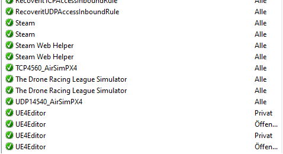

# Installation of PX4 SITL (using WSL)

The following documentation is intended as an additional information to [AirSim's PX4 installation guide](https://microsoft.github.io/AirSim/px4_sitl/) and the [video](https://www.youtube.com/watch?v=DiqgsWIOoW4&t=297s&ab_channel=ChrisLovett). The documentation has further information which is not included in either of the other two instructions. The installation guide assumes that AirSim has already been successfully integrated into an Unreal project.

1. Install WSL (Windows Subsystem for Linux). Open Windows Powershell as administrator and execute `wsl - - install`. It installs all necessary packages including the Ubuntu distribution.
2. Reboot your computer and open Ubuntu as a normal application
3. Execute the following:
```
mkdir -p PX4
cd PX4
git clone https://github.com/PX4/PX4-Autopilot.git --recursive
bash ./PX4-Autopilot/Tools/setup/ubuntu.sh --no-nuttx --no-sim-tools
cd PX4-Autopilot
```

4. Build PX4 and boot the firmware in SITL mode with `make px4_sitl_default none_iris'. To quit the software press CTRL+C.
5. Open a command prompt execute `ipconfig`. It shows you the following output and you must copy the IP-address `IPv4-Adresse . . . . . . . . . . : 192.16.118.1` of your output. It contains the IP address of the host so that WSL can reach it.

```
Ethernet-Adapter vEthernet (WSL):
Verbindungsspezifisches DNS-Suffix:
Verbindungslokale IPv6-Adresse . : fe80::b00e:4bf6:569c:23fa%68
**IPv4-Adresse . . . . . . . . . . : 192.16.118.1**
Subnetzmaske . . . . . . . . . . : 255.255.240.0
Standardgateway . . . . . . . . . :
```

6. Back in Linux, run `nano ~/.bashrc` and add the expression `export PX4\_SIM\_HOST\_ADDR=192.16.118.1` to the end of the document. The last digits are the IP-address of your Windows host and must be identical with the one copied in step 5.

> **NOTE:** If `nano` is not installed yet, install it first. After installation and the changes in the previous step save the file with CTRL+X

7. In Linux, execute the command `ip address show`. It gives you the output below from which you copy the IP-address `inet 192.16.123.122`. This describes the IP address of the Linux system.

```
6: eth0: <BROADCAST,MULTICAST,UP,LOWER_UP> mtu 1500 qdisc mq state UP group default qlen 1000
    link/ether 00:15:5d:05:cc:3c brd ff:ff:ff:ff:ff:ff
    inet 192.16.123.122/20 brd 192.16.126.255 scope global eth0
       valid_lft forever preferred_lft forever
    inet6 fe80::215:5dff:fe05:cc3c/64 scope link
       valid_lft forever preferred_lft forever
```

8. Open the AirSim *settings.json* in Windows which where located at the author's computer at `C:\Users\Username\OneDrive\Documents\AirSim`. Add the following to the settins file:

```
{
"SeeDocsAt": "https://github.com/Microsoft/AirSim/blob/master/docs/settings.md",
"SettingsVersion": 1.2,
"SimMode": "Multirotor",
"ClockType": "SteppableClock",
"Vehicles": {
"PX4": {
"VehicleType": "PX4Multirotor",
"UseSerial": false,
"LockStep": true,
"UseTcp": true,
"TcpPort": 4560,
"ControlIp": "192.16.123.122",
"ControlPortLocal": 14540,
"ControlPortRemote": 14580,
"LocalHostIp": "192.16.118.1",
"Sensors": {
"Barometer": {
"SensorType": 1,
"Enabled": true,
"PressureFactorSigma": 0.0001825
}
},
"Parameters": {
"NAV\_RCL\_ACT": 0,
"NAV\_DLL\_ACT": 0,
"COM\_OBL\_ACT": 1,
"LPE\_LAT": 47.641468,
"LPE\_LON": -122.140165
}
}
},
"OriginGeopoint": {
"Latitude": 47.641468,
"Longitude": -122.140165,
"Altitude": 122
}
}
```

>**NOTE:** The *LocalHostIp* and the *ControlIp* are the ones from step 5 and 7, respectively. I

9. Open TCP port 4560 and UDP port 14540 in the firewall of the Windows system. This will allow the PX4 controller to send data to AirSim. A short video on how to open a TCP port can be found here [https://www.youtube.com/watch?v=xMGPyZtdP00&ab\_channel=RobertMcMillen](https://www.youtube.com/watch?v=xMGPyZtdP00&ab_channel=RobertMcMillen)

10. Start the simulator through the Unreal Editor and execute the PX4 autopilot in Linux with the command `make px4\_sitl\_default none\_iris`


## Troubleshooting if AirSim and PX4 won't connect
>**NOTE:** AirSim and PX4 should be able to communicate with your antivirus software activated. If your antivirus software due to some reasons does not allow a proper communication between both parts, switch it of temporarely. 

- The connection between PX4 and AirSim was succesfull when PX4 writes the output below in the terminal.
- The IP-address of the Windows host `PX4 SIM HOST: 192.16.118.1` must be equal to the one from step 5. If not or if `local host` is written, reboot Ubuntu and try again.

```
PX4 SIM HOST: 192.16.118.1
INFO [simulator] Simulator using TCP on remote host 192.16.118.1 port 4560
WARN [simulator] Please ensure port 4560 is not blocked by a firewall.
INFO [simulator] Waiting for simulator to accept connection on TCP port 4560
INFO [simulator] Simulator connected on TCP port 4560.

```


- If AirSim still does not connect to PX4 SITL firmware check if the firewall blocks Unreal Launcher/Unreal Editior. Open the same settings as in step 9 (*Windows Defender Firewall with Advanced Security*). All the incoming rules in Windows Defender Firewall should be green (see image below). If not allow them. 




- If the PX4 controller still does not connect to AirSim, add the following code to the file located under `PX4-Autopilot/ROMFS/px4fmu\_common/init.d-posix/rcS`. However, it was no longer necessary for the PX4 version v1.13.0 used in the underlying project.

```
#If PX4_SIM_HOST_ADDR environment variable is empty use localhost.
if [ -z "${PX4_SIM_HOST_ADDR}" ]; then
    echo "PX4 SIM HOST: localhost"
    simulator start -c $simulator_tcp_port
else
    echo "PX4 SIM HOST: $PX4_SIM_HOST_ADDR"
    simulator start -t $PX4_SIM_HOST_ADDR $simulator_tcp_port
```

>**NOTE**: If no GPS position can be found, use the command `ip address show` in Linux to double check the IP-address of the virtual machine and compare it again with the AirSim setup file (*settings.json*) in Windows. 

- If you are not sure if the GPS position is set through AirSim open the command terminal *DroneShell* under `AirSim\DroneShell\build\x64\Release` and enter the command `pos`. If *lat*, *lon* and *alt* are 0 the GPS fix did not work.
- If the latest PX4 version does not connect to AirSim or no GPS fix is found after successful connection, downgrade to the older PX4 version (v1.12.0). Therefore change the director in Linux to `/PX4/PX4-Autopilot` and enter the command `git checkout v1.12.0`.


## Some usful additional information

### PX4 Log File Storage Folder

Under Linux go to `/PX4/PX4-Autopilot/build/px4\_sitl\_default/tmp/rootfs/log`

### Helpful Linux Code:

If you have to delete PX4 it may be writte-protected. To delete the folder an reinstall use `sudo rm -rf /my/locked/directory`