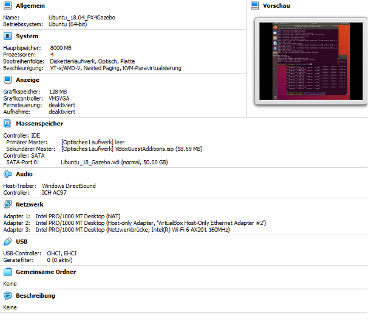

# VM (VirtualBox) Setup:

The installation guide is intended to help the reader to set up the virtual machine correctly via VirtualBox. Ubuntu 18.04 is recommended as operating system when installing Gazebo, PX4 and AirSim. If only PX4 is used together with AirSim, the OS can be upgraded to Ubuntu 20.04.

## Settings PX4 and Gazebo in combination with AirSim

The following settings are recommended for the VM when using PX4, Gazebo and AirSim in combination. The more processors that can be made available to the VM, the better. With two processors, the simulation is able to run but with bad performance. At least 4000 MB of main memory should be provided.

## Settings PX4 in combination with AirSim (without Gazebo)

## Network Settings 

In order for the VM to communicate with the Windows host machine, a host-only network must be added. This can be done via the Host-only Network Manager (see picture below). The adapter can then be added in the settings of the individual VMs. See Adapter 2 under *Network* in the two figures above.

>**NOTE:** In any case, it is recommended to install the VM Guest Additions. This makes the work between host and VM as simple as possible. More information on the[website](https://linuxize.com/post/how-to-install-virtualbox-guest-additions-in-ubuntu/). If, after the installation of the the VM Guest Additions and a shared folder, permission to access the folder is missing, run the command `sudo adduser $USER vboxsf` in the terminal and restart the VM.

